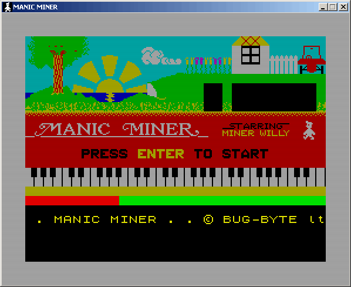



## MANIC MINER \+ JET SET WILLY

### Description

Two classic 8-bit platform games :-) See Readme!.txt for more information. Have fun! (~250 KB). Keywords: classic 8-bit game clone 'Manic Miner' 'Jet Set Willy'  

First release: 4/15/2006 (MM), 7/13/2006 (JSW). 

Last update: 01/16/2012
 
### More Info
 

             |
---                |---
**Submitted On**   |2012-01-16 19:04:36
**By**             |[Carles P\.V\.](https://github.com/Planet-Source-Code/PSCIndex/blob/master/ByAuthor/carles-p-v.md)
**Level**          |Intermediate
**User Rating**    |5.0 (135 globes from 27 users)
**Compatibility**  |VB 6\.0
**Category**       |[Games](https://github.com/Planet-Source-Code/PSCIndex/blob/master/ByCategory/games__1-38.md)
**World**          |[Visual Basic](https://github.com/Planet-Source-Code/PSCIndex/blob/master/ByWorld/visual-basic.md)
**Archive File**   |[MANIC\_MINE2218421172012\.zip](https://github.com/Planet-Source-Code/carles-p-v-manic-miner-jet-set-willy__1-64982/archive/master.zip)

